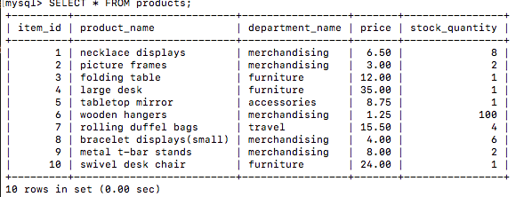
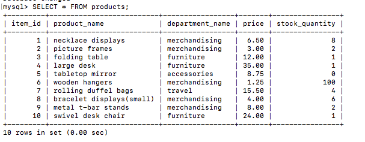

# Bamazon
Storefront application using MySQL, Node.js, and Inquirer

We begin with a MySQL database of products for sale.

## Customer User Flow

1. Customer is shown a table of products available, including:
	* `Item ID`
	* `Product Name`
	* `Price`

2. Using the Node.js module Inquirer, customer is asked for their order.

3. If the quantity of the item requested is more than what's in stock, the customer is informed and asked to start over.
	

4. If sufficient stock is available, the order is filled and customer is given a total amount.

The database is updated on the back end as seen in this example:
